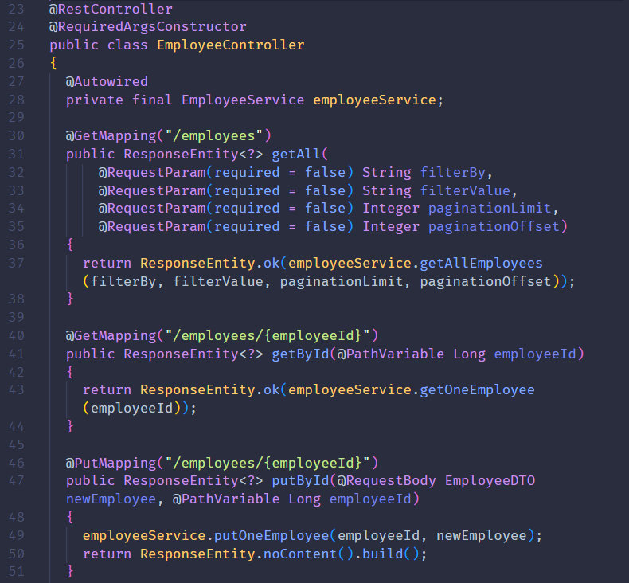

# API Empleados Axpe
Práctica final del período de formación sobre apificación. Servicio API Rest para el control de empleados de una compañía. Cuenta con su especificación OpenAPI 3.0 y su implementación en Spring Boot.

  

